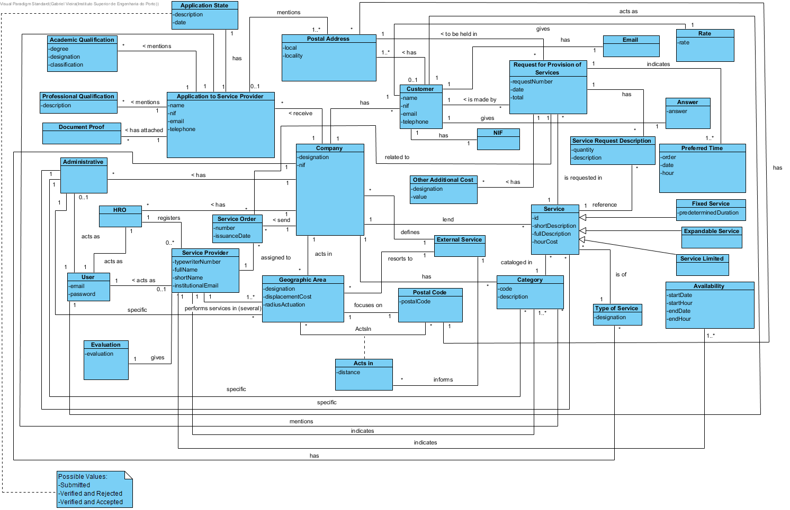

# Analysis OO #

The process of constructing the domain model is based on the use cases, especially the nouns used, and on the description of the assignment.

## Rationale for identifying domain classes ##

For the identification of domain classes is used the list of categories of TP classes (suggested in the book). As a result we have the following table of concepts (or classes, but not software) by category.

### _Categories List_ ###

**Transactions (of business)**

* Service Request 
* Application

---

**Lines of transactions**

* Time Preference 
* Service Request Description 
* Other Additional Cost

---

**Products or services related to transactions**

*  Service
*  Fixed Service
*  Limited Service
*  Expandable Service

---

**Registers (of transactions)**

*  

---  

**People's roles**

* Administrative
* Human Resources Officer (HRO)
* Client
* Service provider
* User
* User Not Registered

---

**Places**

*  Geographical Area
*  Postal Address
*  Postal Code

---

**Events**

* 

---

**Physical objects**

* 

---

**Specifications and descriptions**

*  (Specify) Category (Service)
*  (Specify) Service
*  Academic Qualification
*  Professional Qualification
*  Availability
*  Type of service

---

**Catalogs**

*  

---

**Sets**

*  

---

**Elements of Sets**

*  

---

**Organizations**

*  Company

---

**Other systems (external)**

*  (User Management Component)
*  External Service

---

**Registers (financial), work, contracts, legal documents**

* 

---

**Financial instruments**

*  

---

**Referred documents / to perform the tasks**

* Proof Document

---

### **Rationale on identifying associations between classes**###

An association is a relationship between instances of objects that indicates a relevant connection that is worth remembering, or is derivable from the List of Common Associations:

+ A is physically (or logically) part of B
+ A is physically (or logically) contained in B
+ A is a description of B
+ A is known / captured / registered by B
+ A use or generate B
+ A is related with a transaction of B
+ etc

| Concept (A) 		|  Association   		|  Concept (B) |
|----------	   		|:-------------:		|------:       |
| Administrative | specific | Category |
| | specific | Service |
| | specific | Geographic Area |
| | works for | Company |
| | acts as | User |
|Acts In| informs |External Service
| Company | lend | Service |
|| send | Service Order
| | has | Category |
| | acts in | Geographic Area |
| | has | Customer |
| | has | Administrative |
| | has | HRO |
| | receive | Application to Service Provider |
| | defines | External Service |
| | has (several) | Type of Service |
| Service | cataloged in | Category |
| | is requested in | Request for Provision of Services |
| | referred to in | Service Request Description |
| | is of (one) | Type of Service |
| Fixed Service | is a specialization | Service |
| Service Limited | is a specialization | Service |
| Expandable Service | is a specialization | Service |
| Customer | has | Postal Address |
||has|Email|
||gives|Answer|
||gives|Rate|
| | acts as | User |
| | realizes | Request for Provision of Services |
| Category | catalog | Service |
| | mentioned in | Application to Service Provider |
| | mentioned in | Service Provider |
| Service Provider | acts as | User |
| | indicates (several) | Availability |
| | performs services in (several) | Geographic Area |
| | performs cataloged services in (several) | Category |
| HRO | acts as | User |
||registers|Service Provider
| Application to Service Provider | mentions | Postal Address
| | mentions | Academic Qualification
| | mentions | Professional Qualification
| | mentions | Category
| | has attached | Document Proof
|| has | Application State |
| Request for Provision of Services | is made by | Customer |
||is requested in|Service|
| | includes | Other Additional Cost |
| | indicates | Preferred Time |
| | has | Service Request Description |
| | to be held in | Postal Address |
| Service Request Description | consists | Request for Provision of Services |
| | reference | Service |
| Geographic Area | focuses on | Postal Code |
| | resorts to | External Service |
| | acts in (several) | Postal Code |
| External Service | informs / provides | (Distance + Postal Code) |
| Postal Address | has (a) | Postal Code |
| Service Order | assigned to | Service Provider |
|| related to | Request for the Provision of Services |
||gives|Evaluation|

**Note:** External services provide distance to postal codes. Each pair of Distance + Postal Code information is used to establish the association "acts in" between Geographic Area and Postal Code.

## Domain Model

