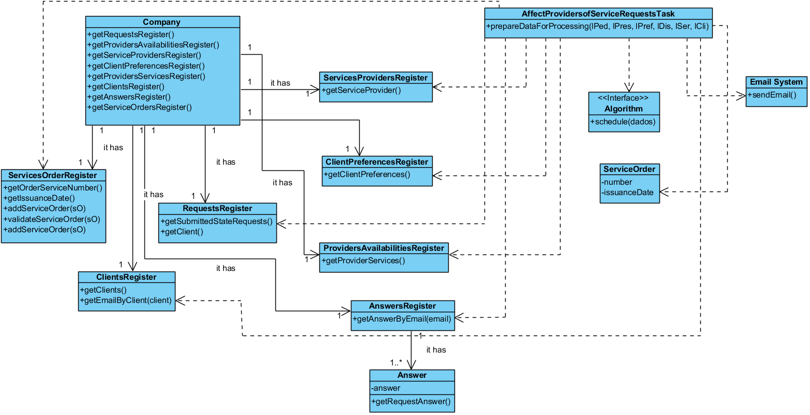

# Realization of UC10 Affect Providers of Services Requests

## Rational

| Main Flow                                                                                        | Answer: What Class...                                      | Answer                                       | Justification                                                                                                         |
|:-------------------------------------------------------------------------------------------------------|:------------------------------------------------------------|:-----------------------------------------------|:---------------------------------------------------------------------------------------------------------------------|
| 1. The process of affecting providers to service requests is initiated.|...coordiantes the UC?|Timer| Controller |
|2. The system associates the requests with the service providers according to the information of the requests submitted and the preferences of the client; the availability of providers and the services they are able to carry out.|...who associates the requests with the servisse providers?|AffectProvidersofServiceRequestsTask||
|3. The system notifies the client by email and requests that the client access the system to accept or reject according to the stipulated schedule. | ... notifies the client by email?|AffectProvidersofServiceRequestsTask|Information Expert (IE)|

## Systematization ##

From the rational it results that the conceptual classes promoted to classes of software are:

AffectProvidersofServiceRequestsTask

Other software classes (i.e. Pure Fabrication) identified:  

 * Timer
 * Company
 * ClientsRegister
 * RegistoDisponibilidadesPrestador
 * ServicesProvidersRegister
 * ProvidersAvailabilitiesRegister
 * AnswersRegister
 * ServicesOrderRegister
 * RequestsRegister

##	Sequence Diagram

##	Class Diagram

