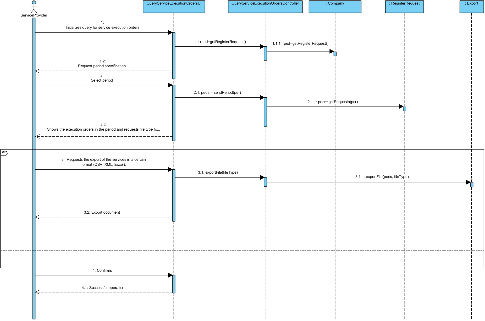
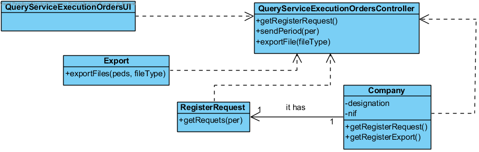

## Realization of UC12 - Query service exection orders

## Rational

| Main Flow                                                                                       | Question: What Class...                                      | Answer                                       | Justification                                                                                                         |
|:-------------------------------------------------------------------------------------------------------|:------------------------------------------------------------|:-----------------------------------------------|:---------------------------------------------------------------------------------------------------------------------|
|1. The service provider starts the service order execution query|... interacts with the user?|QueryServiceExecutionOrdersUI|Pure Fabrication|
||...coordinates the UC?|QueryServiceExecutionOrdersController|Controller|
||...who knows the OrderingServices class?|OrderingServicesRegister| HC + LC |
||...who knows the OrderingServicesRegister?| Company| HC + LC |
|2. The system asks the provider to indicate one of the services |
| 3. The provider selects a service| ...save the requests?| ServiceRequestsRegister|
|4. Request the files for export.| 
|5. The provider enters the files | ...knows the Export class? | Company| HC+LC|
|||...Who saves the formatted files in memory? | Company | (IE)|
|6. The system sends the data to be confirmed.|
| 7. Completion of the process||
                                        
## Sistematization ##

From the rational it results that the conceptual classes promoted to classes of software are:

 * Company
 * ServiceRequest
 * OrderingServicesRegister
 * ServiceRequestsRegister
 * Export

Other software classes (i.e. Pure Fabrication) identify:  

 * QueryServiceExecutionOrdersUI
 * QueryServiceExecutionOrdersController

##	Sequence Diagram

## Class Diagram
