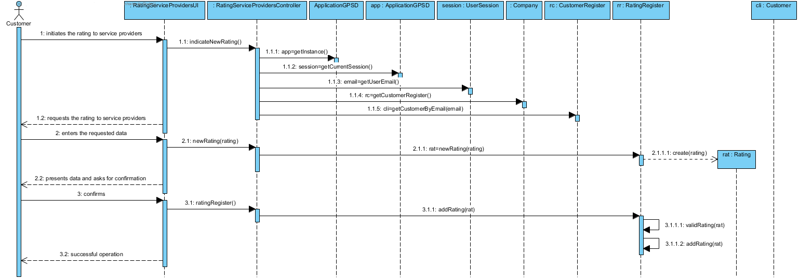
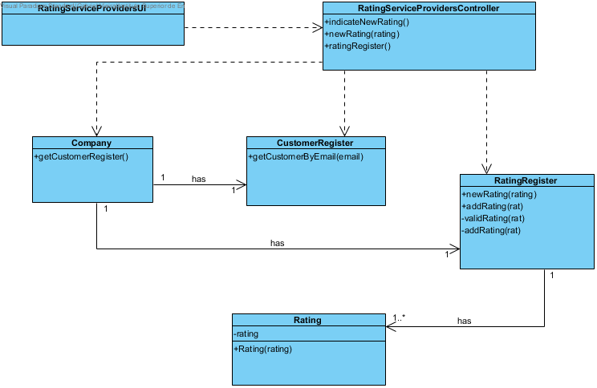

Realization of UC14 Rating Service Providers
==========================================

Rational
--------

| Main Flow                                                               | Question: What Class...                             | Answer                         | Justification                                                                                            |
|-------------------------------------------------------------------------------|----------------------------------------------------|----------------------------------|---------------------------------------------------------------------------------------------------------|
| 1. The customer initiates the rating to service providers.                     | ... interacts with the user?                     | RatingServiceProvidersUI         | PureFabrication, because it is not justified to attribute this responsibility to any existing class in the MD. |
|                                                                               | ...coordinate the UC?                                  | RatingServiceProvidersController | Controller                                                                                              |
| 2. The system requests the rating to service providers.            | n/a                                                |                                  |                                                                                                         |
| 3. The customer enters the requested data.                                   | ... create / instantiate rating?             | Service Provider                         | Creator (rule 4)                                                                                       |
|                                                                               | ... save the entered data?                  | Rating                   | IE - instance created in step 1                                                                        |
| 4. The system validates and displays the data, asking costumer to confirm them.            | ...validates the rating data (local validation)?  | Rating                   | IE: Rating has your own data                                                        |
|                                                                               | ...validate the rating data (global validation)? | Service Provider                          | IE: Service Provider contains / aggregates all your ratings.                                                           |
| 5. The customer confirms.                                                        |                                                    |                                  |                                                                                                         |
| 6. The system informs the customer of the success of the operation. | ...save the created rating?                       | Service Provider                   | IE: Service Provider contains / aggregates all your ratings.                                      |
|                                                                               | ... notifies the user?                         | RatingServiceProvidersUI         |                                                                                                         |

Systematization
--------------

From the rational it results that the conceptual classes promoted to classes of software are:

- Company

- ServiceProvider

- Rating

Other software classes (i.e. Pure Fabrication) identified:

-   RatingServiceProvidersUI

-   RatingServiceProvidersController

Sequence Diagram
---------------------

Class Diagram
-------------------

