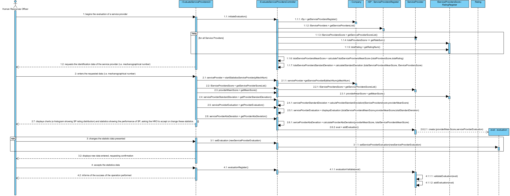
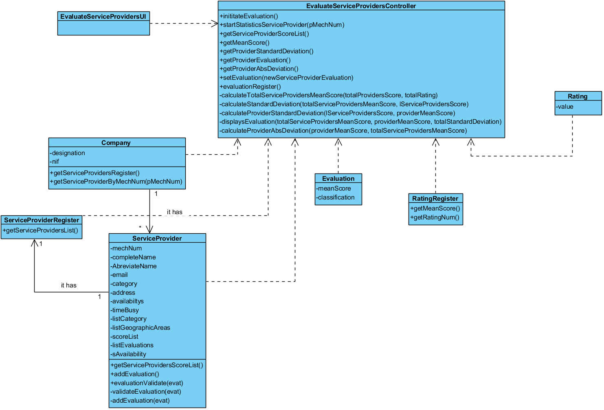

#Realization of UC15  Evaluate Service Providers

## Rational

| Main Flow                                                                                        | Question: What Class...                                      | Answer                                      | Justification                                                                                                         |
|:-------------------------------------------------------------------------------------------------------|:------------------------------------------------------------|:-----------------------------------------------|:---------------------------------------------------------------------------------------------------------------------|
|1. The HRO begins the evaluation of service provider.|... interacts with the user?|EvaluateServiceProvidersUI|PureFabrication,since it is not justified to assign this responsibility to any class exists in the Domain Model.|
||...coordinates the UC?|EvaluateServiceProvidersController|Controller|
||...criate/instance Evaluation?|ServiceProvider|  Creator (Rule 1),  because ServiceProvider aggregates objects from the Evaluation class.|
|2. The system requests the identification data of the service provider (i.e. mechanographical number).| | | |
|3. The HRO enters the requested data.| ... save the entered data?|ServiceProvidersRegister|Information Expert (IE) - instance created in step 1|
|4. The system displays charts (a histograma showing SP rating distribution) and statistics showing the performance of SP, asking the HRO to accept or change these statistics||||
|5. The HRO changes the statistic data presented.|...save the entered data ?|Evaluation|Information Expert|
|6. The system displays new data entered, requesting confirmation.|
|9. The HRO accepts the statistics data. |
|| ... validate Evaluation data?  |ServiceProvider | IE-ServiceProvider has their own data.|
||...add Evaluation data? | ServiceProvider | IE-ServiceProvider has their own data.| 
|7.The system informs of the success of the operation performed.|                                             

## Systematization##

From the rational it results that the conceptual classes promoted to classes of software are:

 * Company
 * ServiceProvidersRegister
 * Service Providers
 * ScoreList
 * Score

Other software classes (i.e. Pure Fabrication) identify:  

 * EvaluateServiceProvidersUI  
 * EvaluateServiceProvidersController

##	Sequence Diagram

##	Class Diagram

