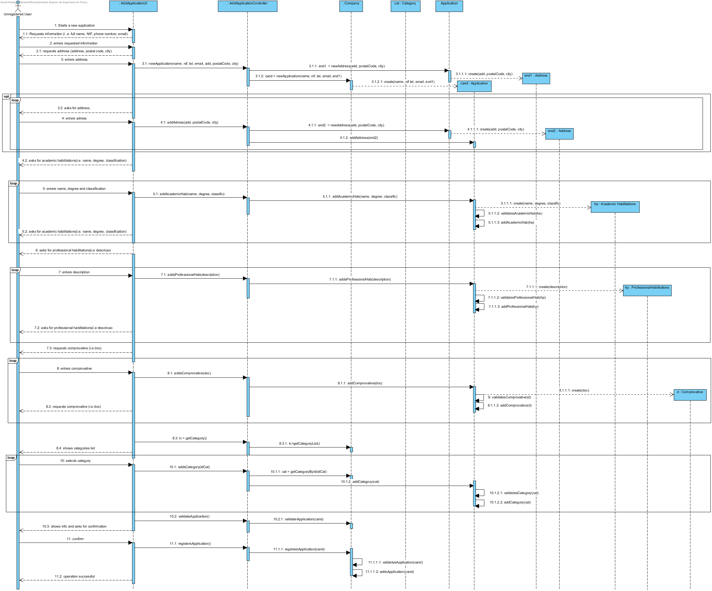
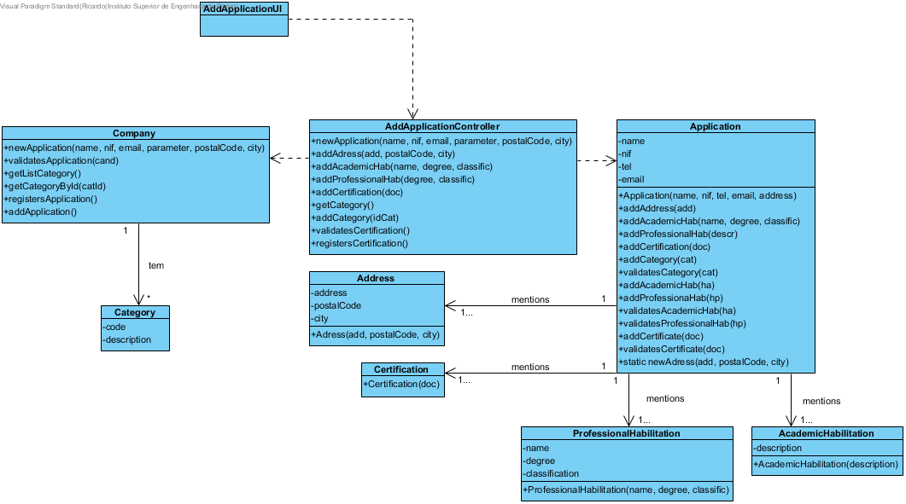

Achievement UC2 Submit Application to Service Provider
=============================================================

Rational
--------

| Main Flow                                                                                        | Question: What Class...                                      | Answer                                      | Justification                                                                                                         |
|:-------------------------------------------------------------------------------------------------------|:------------------------------------------------------------|:-----------------------------------------------|:---------------------------------------------------------------------------------------------------------------------|
| 1. The unregistered user initiates the submission of a new application. | ... interact with the user? | SubmitTypeUI | PureFabrication, as it is not justified to assign this responsibility to any class in the Domain Model. |
| | ... coordinates the UC? | SubmitCandidatureController | Controller |
| | ... create / application application? | About Us | Creator (Rule 1) |
| 2. The system requests the necessary data (i.e. full name of person, NIF, telephone contact and email). | n / a | | |
| 3. The unregistered user enters the requested data. | ... save the data entered? | Application | Information Expert (IE) - instance created in point 1. |
| 4. The system requests a postal address. | n / a | | |
| 5. The unregistered user enters the postal address. | ... create / instance Postal Address? | Application | Creator (Rule 4). |
| | ... save the data entered? | Contact Us | Information Expert (IE) - instance created in this step. |
| 6. The system validates and stores the entered address. | ... do you save the created Postal Address instance? | Application | Information Expert (IE) - In MD the Application mentions one or more Postal Address |
| 7. Steps 4 to 6 are repeated until all the required postal addresses are entered (minimum 1). | n / a | | |
| 8. The system requires an academic qualification. | | | |
| 9. The unregistered user introduces the academic qualification | ... create / request Academic Qualification? | Application | Creator (Rule 1). |
| | ... save the data entered? | HabilitacaoAcademica | Information Expert (IE) - instance created in this step. |
| 10. The system validates and holds the academic qualification. | ... do you have the Academic Enrollment instance set up? | Application | Information Expert (IE) - In the MD the Application mentions academic qualifications. |
| 11. Steps 8 to 10 are repeated until all academic qualifications have been entered. | n / a | | |
| 12. The system requires a professional qualification. | | | |
| 13. The unregistered user introduces the professional qualification. | ... create / request Professional Qualification? | Application | Creator (Rule 1). |
| | ... save the data entered? | HabilitacaoProfessional | Information Expert (IE) - instance created in this step. |
| 14. The system validates and holds the professional qualification. | ... do you have the Professional Qualification instance created? | Application | Information Expert (IE) - In the MD the Application mentions professional qualifications. |
| 15. Steps 12 to 14 are repeated until all professional qualifications have been completed. | n / a | | |
| 16. The system requests supporting documents. | n / a | | |
| 17. The unregistered user introduces supporting document. | ... create / instance Proof Document? | Application | Creator (Rule 1). |
| | ... save the data entered? | Proof Document | Information Expert (IE) - instance created in this step. |
| 18. The system validates and holds supporting document. | ... save the instance of Proof Document created? | Application | Information Expert (IE) - In the MD the Application mentions supporting documents. |
| 19. Steps 16 to 18 are repeated until all supporting documents have been entered. | n / a | | |
| 20. The system shows the categories of services available in the system. | ... do you know the existing categories to list? | About Us | IE: Company has / aggregates all Categories. |
| 21. The unregistered user selects the category of services he intends to perform. | | |
| 22. The system validates and stores the selected category. | ... category guard selected? | Application | Information Expert (IE) - In the MD the Application mentions categories of services. |
| 23. Steps 20 to 22 are repeated until all categories are entered. | | | |
| 24. The system validates and presents the application data to the unregistered user and asks them to confirm them. | ... validate the application data (local validation) | Application | Information Expert (IE) - the Application knows its own data.
| | ... validate the application data (global validation) | About Us | Information Expert (IE) - the Company contains / adds Application.
| 25. The unregistered user confirms the application details. | | | |
| 26. The system registers the new application and informs the unregistered user of the success of the operation. | ... save the specified / created application? | About Us | Information Expert (IE) - In the MD the Company contains / adds Application. |
| | ... inform the unregistered user? | SubmitTypeUI | |

Sistematização
--------------

Do racional resulta que as classes conceptuais promovidas a classes de software
são:

-   Company

-   Address

-   Application

-   AcademicHabilitation

-   ProfessionalHabilitation

-   Certification
 

Other software classes (i.e. Pure Fabrication) identify:  

-   AddApplicationUI

-   AddApplicationController

 ** Note: ** The responsibility of creating instances of Postal Address to the Customer has been assigned.
However, a customer is only valid when he has at least one Postal Address.
That is, to exist a Customer it is necessary to have a Postal Address.
Thus, it is not feasible to ask a Client instance to create a Postal Address.
To resolve this issue the creation of instances of Postal Address is done through a static method in the Client class. Therefore, it is not necessary to have a client instance previously. Other approaches / alternatives are possible.

Sequence Diagram
---------------------

Class Diagram
-------------------

