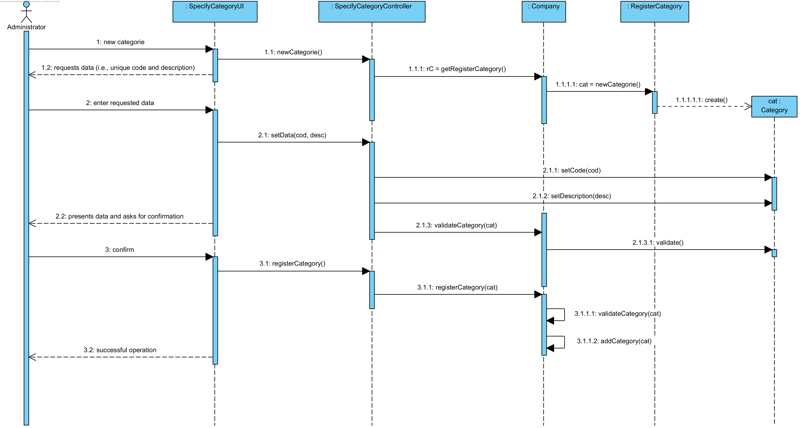

# UC3 Specify Category (Service)

## Rational

| Main Flow                                                                                        | Question: Wich Class...                                      | Response                                      | Justification                                                                                                         |
|:-------------------------------------------------------------------------------------------------------|:------------------------------------------------------------|:-----------------------------------------------|:---------------------------------------------------------------------------------------------------------------------|
| 1. The administrator begins to specify a new category. | ... interacts with the user? | EspecificarCategoriaUI.                          | Pure Fabrication, because it is not justified to assign this responsibility to any class that exists in the Domain Model. |
|| ... coordinates the UC?                                                                              | EspecificarCategoriaController                                | Controller.                                    |                                                                                                                      |
|| ... create/instantiate Category?          | Empresa                                               | Creator (Regra 1)                              |                                                                                                                      |
| 2.	The system requests the required data (i.e., unique code and description). |                  |                                                |                                                                                                                      |
| 3.	The administrator puts the requested data.   | ... save the entered data?                    | Categoria                                     | Information Expert (IE) - instance created in step 1                                                                                              |
| 4.	 The system validates and presents the data to the administrator, asking to confirm them.                                                             | ... validates Category data (local validation)? | Categoria                                     | IE: Category has its own data                                                                                                                   |
|| ... validates Category data (global validation)?                                           | Empresa                                               | IE: The Company contains/aggregates Categories |                                                                                                                      |
| 5. The administrator confirms.                                                                     |                                                             |                                                |                                                                                                                      |
| 6.	The system registers the data and inform to the administrator the success os the operation.                         | ... save the Category specified / created?                            | Empresa                                 | IE. In the Domain Model the Company contains/aggregates Categories                                                                |
|| ... notify the administrator?                                                                                   | EspecificarCategoriaUI                                        |                                                |                                                                                                                      |

## Systematization ##

 From the rational it results that the conceptual classes promoted to classes of software are:

 * Empresa
 * Categoria

Other software classes (i.e. Pure Fabrication) identify:  

 * EspecificarCategoriaUI  
 * EspecificarCategoriaController

##	Sequence Diagram

Two different alternatives are presented.
Alternative 2 is considered more adequate and preferable with respect to alternative 1.

### Alternative 1

**This alternative respects the decisions of the previous rationale, but has room for improvement.**

### Alternative 2

**This alternative respects the decisions of the previous rational.**

This approach considers **"get"** e **"set"** should be avoided / minimized(cf. [here](https://www.javaworld.com/article/2073723/core-java/why-getter-and-setter-methods-are-evil.html)).

This alternative implies the existence of a constructor with parameters in Category.
Therefore, it is not necessary to resort to **"set"**.
The "set" methods that exist will be deprived of the Category class.

This alternative assumes that the objects:

* when they are created they are immediately valid (otherwise there would be an exception);
* they accept modifications to their current state that lead to another valid state.

Therefore, it is not necessary to validate locally the created category object. However, the company continues to perform global validations (e.g., no duplicates).

**ADOPTION THIS APPROACH / ALTERNATIVE IS RECOMMENDED.**

##	Class Diagram

The presented class diagram conforms to the sequence diagram of alternative 2.

the arrow indicates the sense of navigability between objects