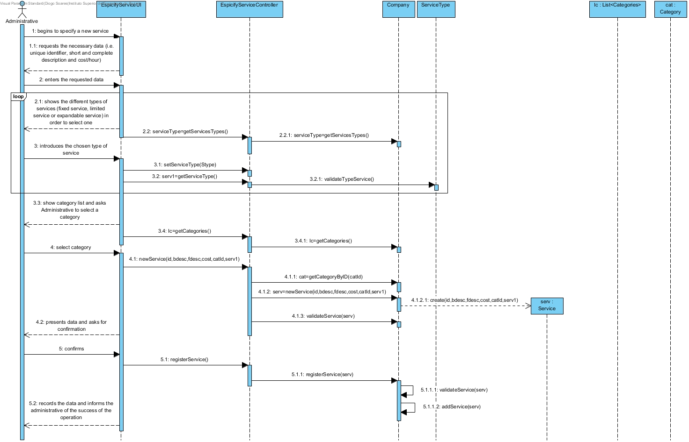
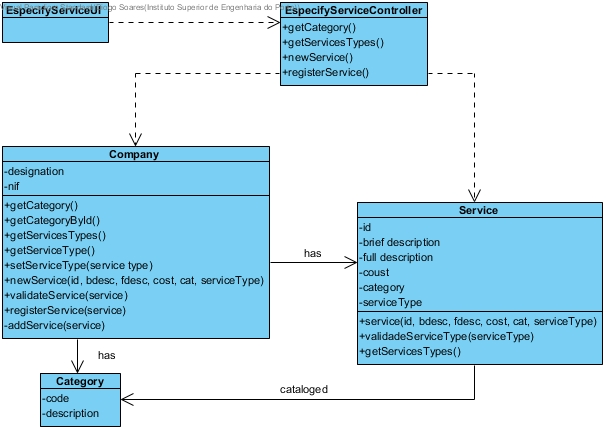

# UC4 Specify Service

## Rational

| Main Flow                                                                                        | Question: Wich Class...                                      | Response                                      | Justificação                                                                                                         |
|:-------------------------------------------------------------------------------------------------------|:------------------------------------------------------------|:-----------------------------------------------|:---------------------------------------------------------------------------------------------------------------------|
| 1. The administrative  begins to specify a new service.| ... interacts with the user?| SpecifyServiceUI| PureFabrication |
||...coordinates the UC?|SpecifyServiceController| Controller |
||...create/instantiate Service?|| Creator (Rule 1) |
| 2. The system requests the necessary data (i.e. unique identifier, short and complete description and cost/hour)| | | |
| 3. The administrative  enters the requested data. | ... save the entered data?| Service | Information Expert (IE) - 
instance created in step 1|
| 4. The system shows the different types of services (fixed service, limited service or expandable service) in order to select one.| | | |
| 5. The administrative  introduces the chosen type of service. | ... save the entered data?|Company | Information Expert (IE) - The Company provides services.|
| 6. **The system shows the list of existing categories so that the Administrative can select one.**| ...know the existing categories to list?| Company| IE: Company has / aggregates all Categories|
| 7. **The administrative selects the category in which you want to catalog the service.**| ... save the selected category?| Servico| IE: Categorized service - instance created in step 1|
| 8. The system validates and presents the data to the administrative, asking you to confirm them.| ...validates the Service data (local validation)?| Service| IE: Service has its own data|
| | ...validates the Service data (global validation)?| Company | IE: The Company contains / aggregates Services|
| 9. The administrative confirms.| | | |
| 10. The system records the data and informs the management of the success of the operation.| ... save specified / created service?| Company | IE.In the MD the Company contains / adds Services |
|| ... notify the user?                                                                                   | EspecifyServiceUI                                        |                                                |                                                                                                                      

## Systematization ##

 From the rational it results that the conceptual classes promoted to classes of software are:

 * Company
 * Service
 * Category
 * ServiceType

Other software classes (i.e. Pure Fabrication) identify:  
  
 * EspecifyServiceUI  
 * EspecifyServiceController

##	Sequence Diagram

##	Class Diagram

