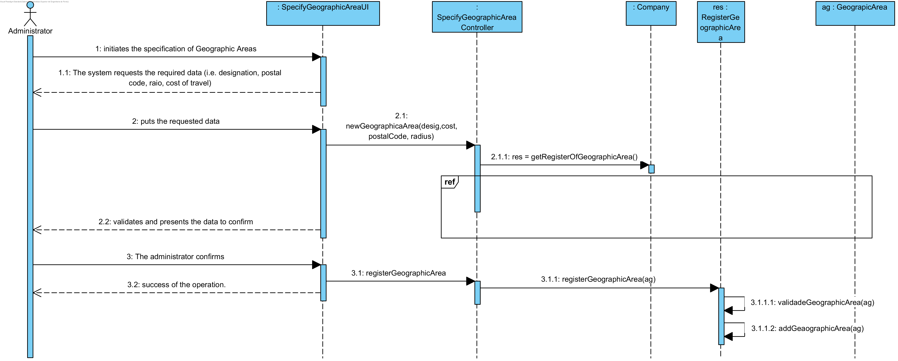
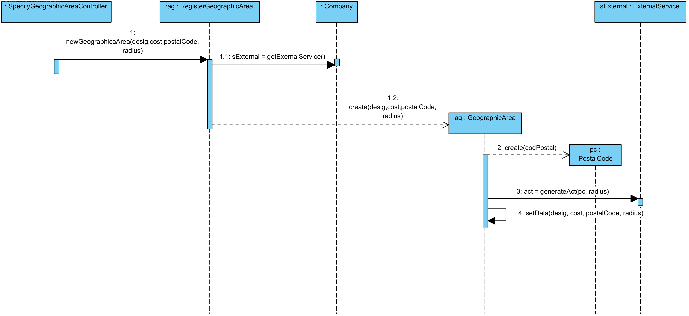
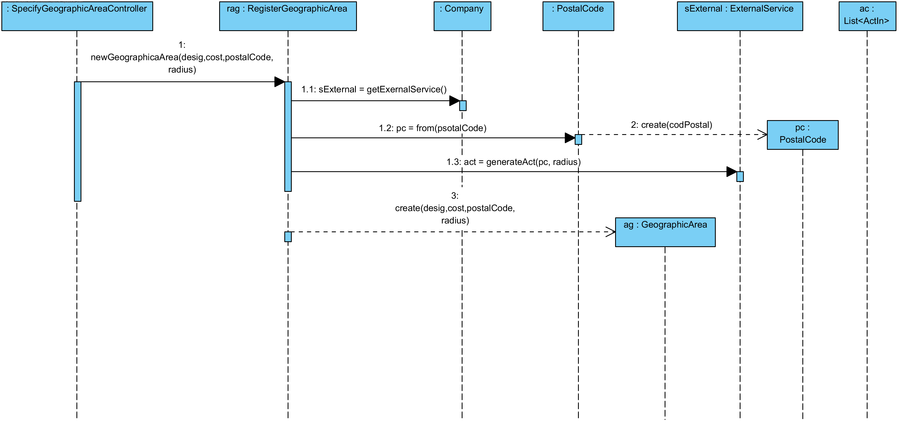
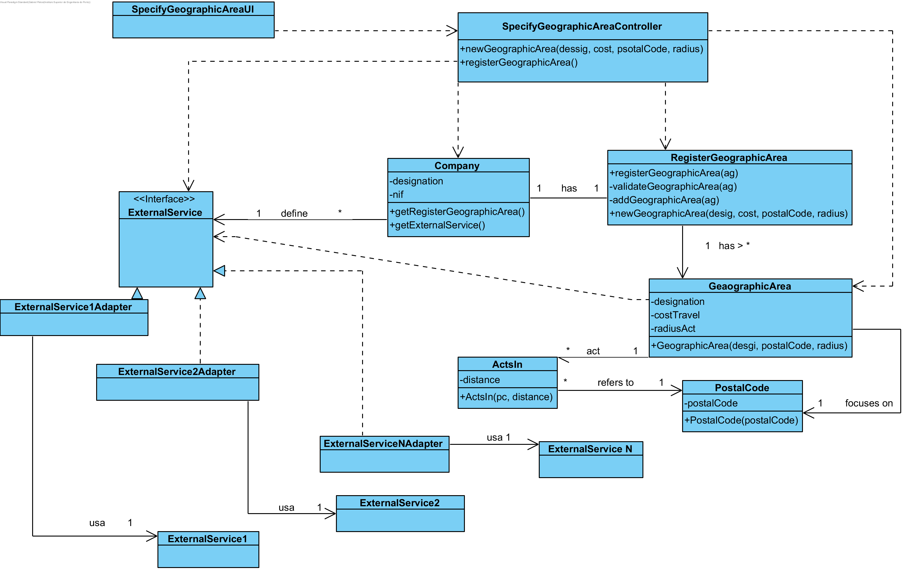

# UC5 - Specify Geographic Area

## Rational

| Main Flow                                                                                        | Question: Wich Class...                                      | Answer                                       | Justification                                                                                                          |
|:-------------------------------------------------------------------------------------------------------|:------------------------------------------------------------|:-----------------------------------------------|:---------------------------------------------------------------------------------------------------------------------|
| 1. The administrator begins to specify a new Geographic Area. | ... interage com o utilizador? | SpecifyGeographicAreaUI.                          | Pure Fabrication, because it is not justified to assign this responsibility to any class that exists in the Domain Model. |
|| ... coordinates the UC?                                                                              |  SpecifyGeographicAreaController                                | Controller.                                    |                                                                                                                      |
|| ... create/instantiate Geaographic Area?          | RegisterGeographicArea                                               | Creator (Rule 1) + HC+LC : Company delegates to RegisterGeographicArea                             |                                                                                                                      |
| 2. The system requests the required data (i.e. designation, **postal code, radius,** cost of travel).  |                  |                                                |                                                                                                                      |
| 3.	The administrator puts the requested data.   | ... save the entered data?                    |GeaographicArea                                    | Information Expert (IE) -instance created in step 1                     |
| 4.	 **The system gets the postal codes covered by the new Geographic Area**, validates and presents the data to the administrator, asking to confirm them.                                                              | ... validates Geaographic Area data (local validation)? | GeographicArea                                     | IE: Geographic area has its own data                                                                                                                   |
|| ... validates Geaographic Area data (global validation)?                                           | RegisterGeographicArea                                              | IE: RegisterGeographicArea contains/aggregates Area Geographica |                                                                                                                      |
||...makes postal codes available within a radius of|ExternalService|IE: in Model Domain ExternalService gives this information. |
||...what is the expected result of the External Service|List\<ActsIn>|IE: in Model Domain ExternalService informs many "ActsIn". |
||... knows the ExternalService|Company|IE: in Model Domain Company defines ExternalService. Protected Variation over ExternalService since the system must support several external services|
||...does it implement the particularities of each specific external service?|ExternalServiceXXXAdapter|ProtectedVariation + Adapter|
| 5. The administrator confirms.                                                                    |                                                             |                                                |                                                                                                                      |
| 6.	The system registers the new Geograhic Area and informs the administrator the success of the operation.                           | ... save the Geaographic Area specified/created?                            | Company                                 | IE. In MD, the Company operates in several geographic areas                                                                |
|| ...notify the administrator?                                                                                      | SpecifyGeographicAreaUI                                       |                                                |                                                                                                                      |

## Systematization ##

 From the rational it results that the conceptual classes promoted to classes of software are:

 * Company
 * GeaographicArea
 * ExternalService
 * ActsIn

Other software classes (i.e. Pure Fabrication) identify:

 * SpecifyGeographicAreaUI  
 * SpecifyGeographicAreaController
 * RegisterGeographicArea

##	Sequence Diagram
### Base Solution

**This base solution is complemented / detailed with one of the alternatives presented below.
"Interaction Use" was applied so that the Sequence Diagram refers to the diagram that details / complements it.**

### Detail - Alternativa A

### Detail - Alternativa B

### Detail - Outras Alternativas

Other alternatives are possible and acceptable.
For example, an alternative similar to alternative A but adopting the form of creation of "CodePostal" used in alternative B (through the "from" method).

**However, the way of creating "Postcode" of alternative A (through its constructor) is more coherent with the rest of the proposed solution.**

##	Class Diagram
According to alternative A.

