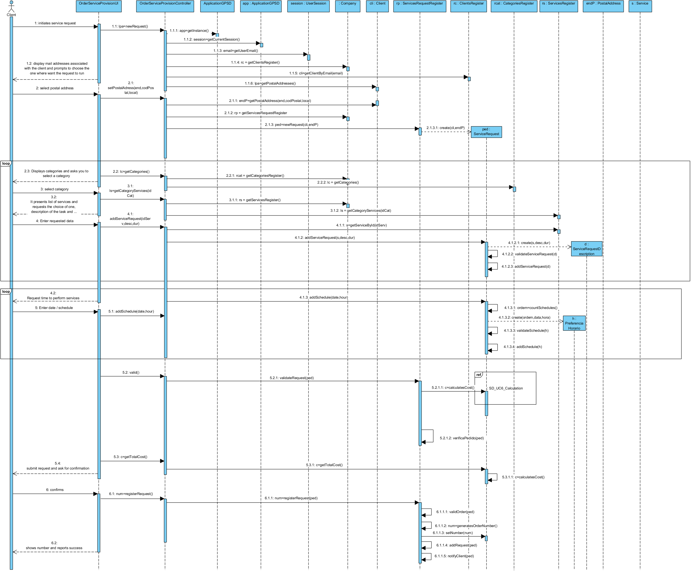
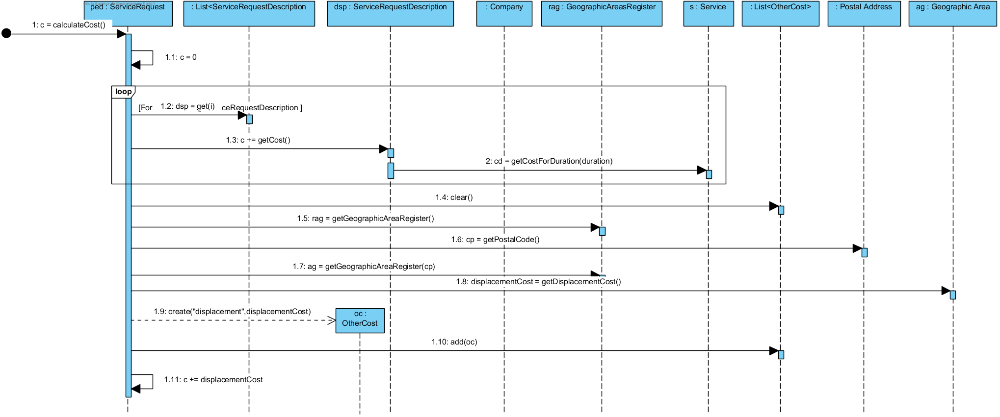
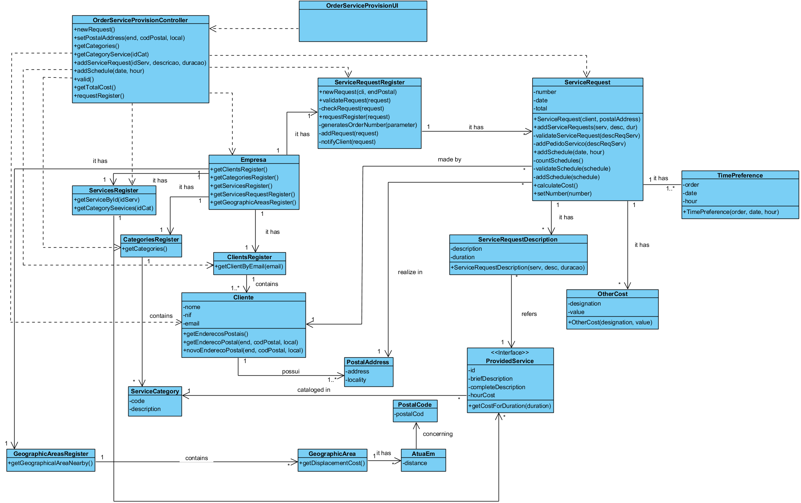

# Realization of UC6 Order Service Provision

## Rational

| Main Flow                                                                                       | Question: What Class...                                      | Answer                                       | Justification                                                                                                       |
|:-------------------------------------------------------------------------------------------------------|:------------------------------------------------------------|:-----------------------------------------------|:---------------------------------------------------------------------------------------------------------------------|
|1. The customer initiates the service request.  | ... interacts with the user? | OrderServiceProvisionUI | Pure Fabrication, because it is not justified to attribute this responsibility to any class exists in the Domain Model. |
|| ... coordinates the UC? | OrderServiceProvisionController | Controller | |
|| ... create/instance request for service? | RegistoServiceRequest | Creator (rule 1) + HC +LC about company| |
|2.The system shows the clients associated with the client and asks you to choose the address in the form that the services are rendered.|  ... do you know the customer's postal addresses? | Client | IE: The client have 1 or more Postal Addresses |
|3. The customer selects the desired postal address. |
... save the selected postal address? | RequestPrestacaoServico | IE: Instance created previously. In the MD a ServiceRequest is made in a Postal Address. |
|4. The system displays the service categories and asks the customer to select one.|... knows the existing categories? | RegistoCategories | IE: RegistoCategories has Categories|
|5. The customer selects the desired category. | | | |
|6.The system provides the indications for the task of performing the task of selecting and filling with the task description and, if so, the duration of the service rendering, the duration of the execution and the duration of the task. | ...know the services of a given category? | RegistoServices | IE: RegistoServicess know all the services. |
|||Service|IE: In MD know the Category in which it is cataloged.|
|7. The customer selects the desired service and enters the description and estimated duration. | |||
|8. The system validates and saves the information entered. |...save the date entered?|DescriptionServiceRequest|IE: In MD a Request has several Service Description Ordered with this data|
||...create/instance DescriptionServiceRequest?|ServiceRequest|Creator (rule 1)|
||...validate the data?(local)| DescriptionServiceRequest |IE: are themselves own data|
||...validate the data?(global)| ServiceRequest |IE: it knows all its descriptions|
|9. The steps 4 to 8 are repeated until all the services intended by the client are specified.||||
|10. The system prompts you to enter a preferred time (start date and time) to execute the task. ||||
|11. The customer enters the desired schedule.|||| 
|12. The system validates and saves the schedule entered.|...validate and save the indicated schedule?|TimePreference|IE: it is the data of his concepts.|
||| ServiceRequest |IE: In MD one ServiceRequest has many TimePreference |
||...create/instance TimePreference?|ServiceRequest|Creator(rule 1)|
|13. The steps 10 to 12 are repeated until at least one time is set.
|14. The system validates the request, calculates the estimated cost, and presents the result to the customer asking them to confirm. |... validate the request?(local validation)|ServiceRequest|IE: knows your own information.|
||...validate the request? (global validation)|RegistoServiceRequest|IE: RegistoServiceRequest knows all the requests|
||...calculates the total cost?|ServiceRequest|IE:know all the services requested and the postal address where they will be provided.|
||| DescriptionServiceRequest |IE: knows the duration and the intended service.|
||| Service |IE: know your cost/hour.|
||...save the displacement cost ?|OtherCost|IE: in MD an order has several Other Cost|
||...create/instance OherCost| ServiceRequest |Creator (rule 1)|
|15. The cliente confirms the request. 
|16.The system registers it, assigns it a sequence number, **sends the request information by email to the customer ** and presents it to the customer along with a message of success.| ... 
generates the sequence number? | RegistoServiceRequest |IE.: knows all the requests already received.|
||...
save the sequential number?|ServiceRequest|IE: instance created earlier|
||...save the request?| RegistoServiceRequest |IE: RegistoServiceRequest receives all the orders.|
||...notify the client by email?| RegistoServiceRequest ||
||...notifies the number generated and the information of successor email the customer?| 
OrderServiceProvisionUI ||

## Systematization ##

From the rational it results that the conceptual classes promoted to classes of software are:

 * Company
 * Client
 * Service
 * Category
 * ServiceRequest
 * DescriptionServiceRequest
 * TimePreference
 * OtherCost

Other classes of software (i.e. Pure Fabrication) identified:  

 * OrderServiceProvisionUI  
 * OrderServiceProvisionController
 * RegistoClients
 * RegistoCategories
 * RegistoServices
 * RegistoServiceRequest
 * RegistoGeographicAreas

##	Sequence Diagram

##	Class Diagram

