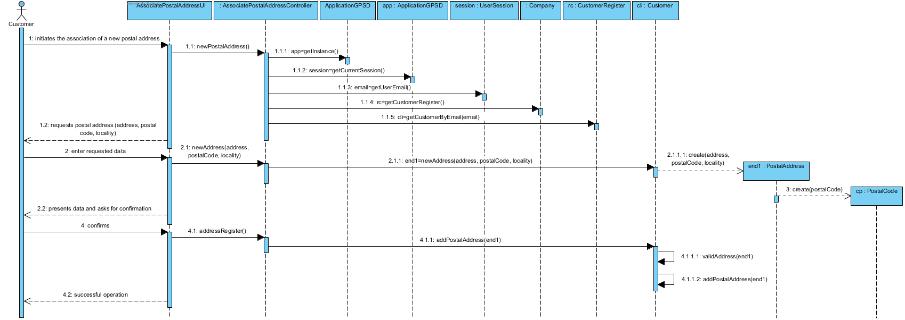
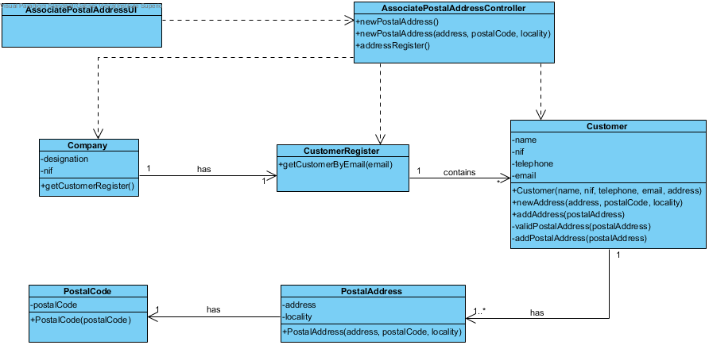

Realization of UC7 Associate Postal Address with Customer
==========================================

Rational
--------

| Main Flow                                                               | Question: What Class...                             | Answer                         | Justification                                                                                            |
|-------------------------------------------------------------------------------|----------------------------------------------------|----------------------------------|---------------------------------------------------------------------------------------------------------|
| 1. The customer initiates the association of a new postal address with their information.                     | ... interacts with the user?                     | AssociatePostalAddressUI         | PureFabrication, because it is not justified to attribute this responsibility to any existing class in the MD. |
|                                                                               | ...coordinate the UC?                                  | AssociatePostalAddressController | Controller                                                                                              |
| 2. The system requests the required data (i.e. postal address).            | n/a                                                |                                  |                                                                                                         |
| 3. The customer enters the requested data.                                   | ... create / instantiate postal addresses?             | Customer                         | Creator (rule 4)                                                                                       |
|                                                                               | ... save the entered data?                  | PostalAddress                   | IE - instance created in step 1                                                                        |
|||PostalCode|IE: one Postal Address has one Postal Code|
| 4. The system validates and displays the data, asking costumer to confirm them.            | ...validates the address data (local validation)?  | PostalAddress                   | IE: PostalAddress has your own data                                                        |
|                                                                               | ...validate the address data (global validation)? | Customer                          | IE: Customer contains / aggregates all your postal addresses.                                                           |
| 5. The customer confirms.                                                        |                                                    |                                  |                                                                                                         |
| 6. The system associates the postal address with the customer and informs the customer of the success of the operation. | ...save the created Postal Address?                       | Customer                   | IE: Customer contains / aggregates all your postal addresses.                                      |
|                                                                               | ... notifies the user?                         | AssociatePostalAddressUI         |                                                                                                         |

Systematization
--------------

From the rational it results that the conceptual classes promoted to classes of software are:

- Company

- Customer

- PostalAddress

- PostalCode

Other software classes (i.e. Pure Fabrication) identified:

-   AssociatePostalAddressUI

-   AssociatePostalAddressController

Sequence Diagram
---------------------

Class Diagram
-------------------

