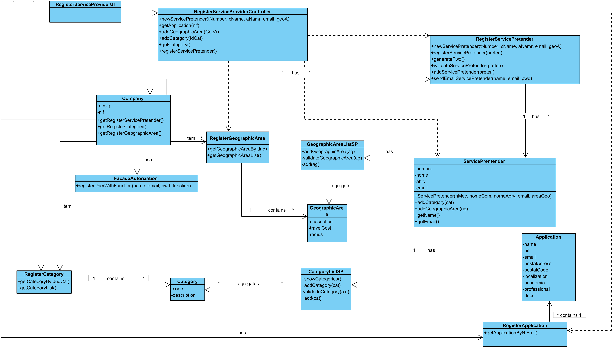

#  UC8 Register Service Provider

### Racional 

| Main Flux                                                                                       | Question :  Wich Class...                                      | Answer                                       | Justification                                                                                                         |
|:-------------------------------------------------------------------------------------------------------|:------------------------------------------------------------|:-----------------------------------------------|:---------------------------------------------------------------------------------------------------------------------|
|1. The Human Resources Officer starts registering the new Service Provider.|... interacts with the Human Resources Officer ?|RegisterServiceProviderUI|PureFabrication UI|
||...coordenates UC?|RegisterServiceProviderController|PureFabrication Controller|
||...create/instanciate ServicePretender ?|RegisterServiceProvider| Pattern HC + LC (Company) + Creator (Regra 1)|
|2. The System requests the NIF of the Service Pretender |||||
|3. The Human Resources Officer introduces the NIF|...save the Applications ?|RegisterApplications| Pattern HC + LC (Company) + Creator (Regra 1)|||||
|2. The system requests the necessary data (i.e. typing number, full and abbreviated name, institutional email, service categories and geographic areas of activity).| | | |
|3. The Human Resources Officer  enters the requested data. | ... save the entered data?|ServiceProvider|Information Expert (IE) - instance criated in step one|
|4. The system shows the existing service categories and requests one.|RegisterCategory|Information Expert (IE)|
|5. The Human Resources Officer  selects the desired service category.|||||
|6. The system validates and stores the selected category.|... save the selected category?| ServicePretender (include the category list of the Service Pretender)|Information Expert (IE) - In MD the Service Provider is enabled in one or more categories|
|7. Steps 4 to 6 are repeated until all the desired categories are selected (minimum 1).||||
|8. The system shows the existing geographic areas and requests one.|...knows the geographical areas?|RegisterGeographicArea|IE|
|9. The Human Resources Officer  selects the intended geographical area.||||
|10. The system validates and stores the selected geographical area.|... save the selected geographic area?| Service Pretender (include the geographic area list of SP) |Information Expert (IE) - In Domain Model the Service Pretender act in one or more geographic areas|
|11. Steps 8 through 10 are repeated until all the desired geographic areas are selected (minimum 1).||||
|12. The system validates and displays the data, asking you to confirm them.|...validates the data of the Service Provider (local validation)?|Service Provider|IE: The Service Provider has his own data|
||...validate Service Provider data (global validation)?|RegisterServiceProvider|IE: The RegisterServiceProvide contains / aggregates Service Providers|
|13. The Human Resources Officer  confirms. ||||
|14. The system **registers the data of the new Service Provider, sends the access data to the new Service Provider** and informs the Human Resources Officer  of the success of the operation..|...save the registered Service Provider?|RegisterServiceProvider|IE. the RegisterServiceProvider contains / aggregates Service Providers|
|| ... save the user data of this Service Provider?  | FacadeAuthorization | IE. User management is the responsibility of the respective external component whose point of interaction is through the class "FacadeAuthorizatio" |   
|| ... notifies the Service Provider of their access data? | RegisterServiceProvider | IE: has the data to this task.|                                               

## Systematization ##

 From the rational it results that the conceptual classes promoted to classes of software are:

 * Company
 * Human Resources Officer
 * ServiceProvider
 * Category
 * Geographic Area

Other software classes (i.e. Pure Fabrication) identify:

 * RegisterServiceProviderUI
 * RegisterServiceProviderController
 * RegisterServiceProvider
 * RegisterCategory
 * RegisterGeographicArea
 * FacadeAutorization

##	Sequence Diagram

** Note: ** The Service Provider has two lists (ListPSategoriesPS and ListGPSPS) obtained by application of HC + LC. However, it was decided not to expose these lists abroad. That is, the delegation of responsibilities that occurred is not known from the rest of the system (i.e. private delegation of responsibilities).

##	Class Diagram

