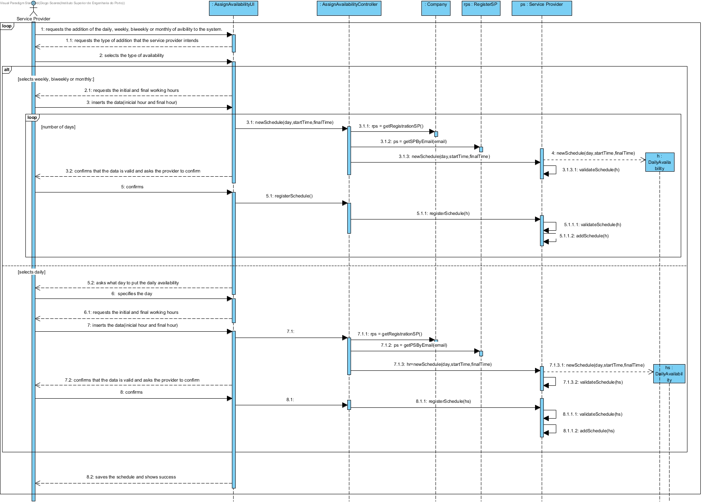
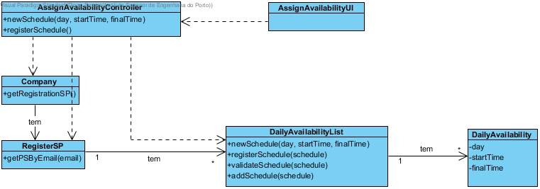

# Achievement UC9 Indicate Daily Availability of Services

## Rational

| Main Flow                                                                                       | Question: What Class...                                      | Answer                                       | Justification                                                                                                        |
|:---------------|:-----------------|:-----------|:-----------|
| 1. The service provider requests the addition of the daily, weekly, biweekly or monthly of availability to the system.| ... interacts with the user?| AssignAvailabilityUI| PureFabrication |
||...coordinates the UC?|DisponibilidadeController| Controller |
||...create / instantiate the availability record?|Service Provider| Creator (Rule) 1) |
| 2. The system requests the type of addition that the service provider intends| | | |
| 3. The provider selects the type of availability. | ...save the entered data?| ServiceProvider | Information Expert (IE) - instance created in step 1||||
| 4. If the provider selects weekly, biweekly or monthly:| | | |
| 5. The system requests the initial and final working hours.| | | |
| 6. The provider inserts the data. | ...save the entered data?| Service Provider | Information Expert (IE) - instance created in step 1|
| 7. The system validates and displays the data and prompts for confirmation.| ...validate the registration data (local validation)?| DailyAvailability | IE: DailyAvailability has its own data|
| | ...validates the availability data (global validation)?| Servide Provider | IE: Service Provider contains / aggregate DailyAvailability||
| 8. The provider confirms.| | | |
| 9. If the provider selects daily:| | | |
| 10. The system requests the day that Service Provider want to place daily availability.| | | |
| 11. The provider specifies the day. | ...save the entered data?| Service Provider | Information Expert (IE) - instance created in step 1|
| 12. The system requests the initial and final working hours.| | | |
| 13. The provider inserts the data. | ... save the entered data?| Service Provider | Information Expert (IE) - instance created in step 1|
| 14. he system validates and displays the data and prompts for confirmation.| ...validate the registration data (local validation)?| DailyAvailability | IE: DailyAvailability has its own data|
| | ...validates the availability data (global validation)?| Service Provider |  IE: Service Provider Contains / aggregate DailyAvailability||
| 15. The provider confirms.| | | |
| 16.The system saves the Availabilty and shows success.| ...do you keep the new availability record specified / created?| DailyAvailability | IE. In DM the Service Provider contains / aggregate DailyAvailability |
|| ... notify the user?                                                                                  | 
AssignAvailabilityUI                                        |                                                |                                                                                                                      

## Systematization##

From the rational it results that the conceptual classes promoted to classes of software are:

 * Service Provider
 * Company
 * Schedule
 * AvailabilityList

Other software classes (i.e. Pure Fabrication) identify: 

 * AssignAvailabilityUI  
 * AssignAvailabilityController
 * RegisterSP

##	Sequence Diagram

##	Class Diagram

