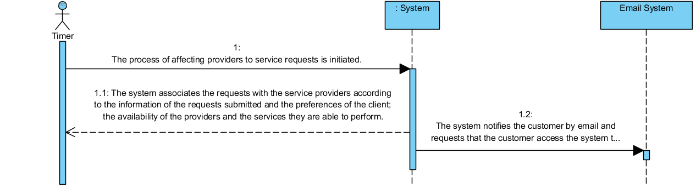

# UC10 - Affect Providers of Service Requests

## Short Format

The process of affecting providers to service requests is initiated. 
The system associates the requests with the service providers according to the information of the requests submitted and the preferences of the client; the availability of the providers and the services they are able to perform. The system notifies the client by email and requests that the client access the system to accept or reject according to the stipulated time.

## SSD

## Full Format

### Main Actor

Timer

### Stakeholders and their interests
* **Client:** want to be associated with a service provider. 
* **Company:** wants services to be associated with providers successfully.

### Pre-conditions
The execution period of this process must be preconfigured.

### Post-conditions
The client is notified by email to accept or reject the stipulated time for the service.

## Main success scenario (or basic flow)

1. The process of affecting providers to service requests is initiated.
2. The system associates the requests with the service providers according to the information of the requests submitted and the preferences of the client; the availability of the providers and the services they are able to perform.
3. O sistema notifying by email the client and requests that atued the system to accept or reject according stipuladed schedules.

### Extensions (or alternative flows)

2a. There are no requests to provide services defined in the system.
> The system informs this. The use case ends.

2b. There are no client preferences defined in the system.
>   1. The system informs this.
>
	> 2a. The  use case ends.

2c. There are no availability of providers defined in the system.
>   1. The system informs this.
>
	> 2a. The use case ends.

2d.There are no services that providers are able to perform defined in the system.