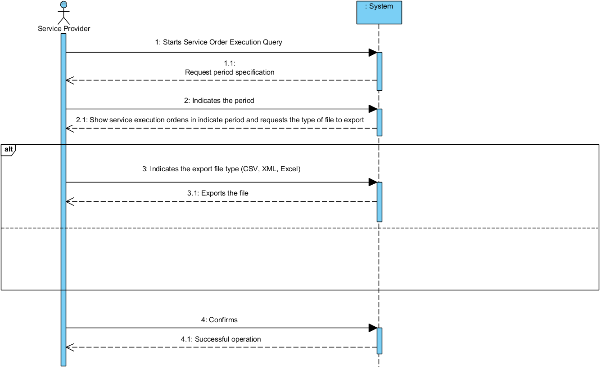

# UC12 -Query Service Execution Orders

## Short Format

## SSD

## Full Format

### Main Actor	
Service Provider

### Stakeholders and their interests

 
### Pre-conditions

### Post-conditions

## Main success scenario (or basic flow)
1. Starts the service order query
2. Request the specification of the period
3. Select period
4. Shows execution orders and execution type
5. Send data in file formats
6.The system confirms
7. Operation completed.

### Extensions (or alternative flows)
6a. Invalid files
> Ends the process.

6b. Other data entered is invalid
> Ends the process.

### Special requirements
\-

### List of Variations of Technologies and Data
\-

### Frequency of occurrence
\-

### Open questions