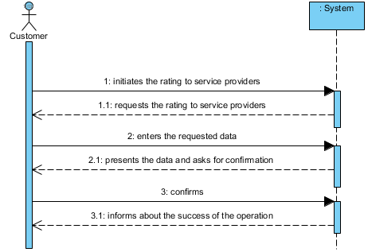

UC14 – Rating Service Providers
==============================

Short Form
-------------

The customer initiates the rating to service providers. The system requests the rating to service providers. The customer enters the requested data. The system validates and displays the data, asking costumer to confirm them. The customer confirms. The system informs the customer of the success of the operation.  

SSD
---

Full Format
----------------

### Main actor

Customer

### Stakeholders and their interests

-   **Customer:** pretends to rating the service providers.

### Pre-conditions

Be authenticated in the system as a customer.

### Post-conditions

The rate given by client to service provider is stored in the system.

Primary success scenario (or base flow)
----------------------------------------------

1. The customer initiates the rating to service providers. 
2. The system requests the rating to service providers. 
3. The customer enters the requested data. 
4. The system validates and displays the data, asking costumer to confirm them.
5. The customer confirms.
6. The system informs the customer of the success of the operation.    

### Extensions (or alternate flows)

\*a. The customer requests the cancellation of rating service providers.

>   The use case ends.

4a. Required minimum data missing.

>   The system informs the customer about data is missing.

>   The system allows the customer to enter the missing data (step 2)

>   2a. The customer does not change the data. The use case ends.

4c. The system detects that the entered data (or some subset of the data) is invalid.

>   The system alerts the customer to the fact.

>   The system allows the customer to change it (step 2)

>   2a. The customer does not change the data. The use case ends.

### Special requirements

\-

### List of Variations of Technologies and Data

\-

### Frequency of Occurrence

\-

### Open questions

\-