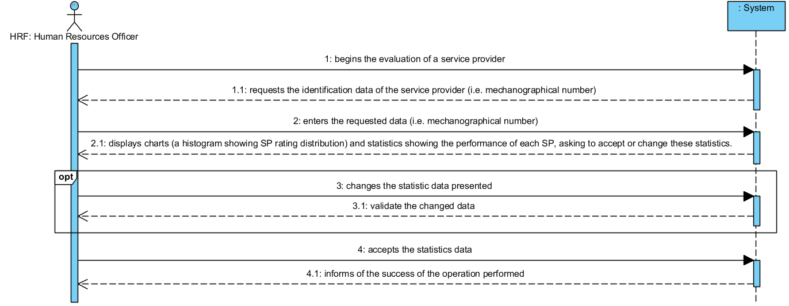

# UC15 - Evaluate Service Providers

## Short Format

The Human Resources Officer (HRO) begins the evaluation of a service provider (SP). The system requests the identification data of the service provider to be evaluated (i.e. mecanographical number). The HRO enters the requested data (mecanographic number). The system displays charts (a histogram showing SP rating distribution) and statistics showing the performance of SP, asking the HRO to accept or change these statistics. The FRH changes the statistics data presented if necessary. The system validate the changed data (if necessary) .The HRO accepts the statistics. 
The system informs the HRO of the success of the operation performed.

## SSD

## Full Format

### Main Actor

Human Resources Officer 

###  Stakeholders and their interests
* **Human Resources Officer:**  It aims to evaluate the service providers so that the evaluations of the service providers can be seen by the customers.
* **Client:** It intends to choose the best service provider, taking into account the evaluations of the same.
* **Company:**  You want to know the evaluations of your service providers.

### Pre-conditions
n/a

### Post-conditions

The evaluation information is stored in the system.

## Main success scenario (or basic flow)

1. The Human Resources Officer begins the evaluation of a service provider.
2. O The system requires the necessary data (i.e. mecanographical number). 
3. The Human Resources Officer enters the requested data. 
4. The system displays charts and statistics showing the performance of each service provider, asking the HRO to accept or change these statistics.
5. The HRF changes the statistics data presented if necessary.
6. The system validate the changed data if necessary.
7. The HRF accepts the statistics.
8. The informs the HRO of the success of the operation prformed.

### Extensions (or alternative flows)

*a. The HRF requests the cancelaation of evaluation. 
> The use case ends.

**3a. Invalid inserted mechanographical number**
>	1. The system informs  the user about invalid mechanographical.
>	2. The system allows to enter new mechanographical number (step 2)
>
	>	2a. The HRO don`t change mechanographical number . The use case ends.

3b. Mechanographic number inserted does not exist.
>	1. The system informs tells which data not exist.
>	2. The system allows to enter the nonexistent data (step 2)
>
	>	2a. The HRO don`t change data. The use case ends.
	
6a. The system detects that the data entered (or some subset of the data) is invalid.
>	1. The system alerts HRO.
>	2. The system allows to change (step 5)
>
	>	5a. The HRO don`t change data. The use case ends.

### Special requirements
\-

### List of variations of technologies and data
\-

### Frequency of occurence
\-

### Open questions

*What are the mechanisms for validating the change of statistics by the service provider?
* Is it necessary to have an additional security mechanism to confirm that the human resources officer is in fact who he claims to be?
* How often does this use case occur?