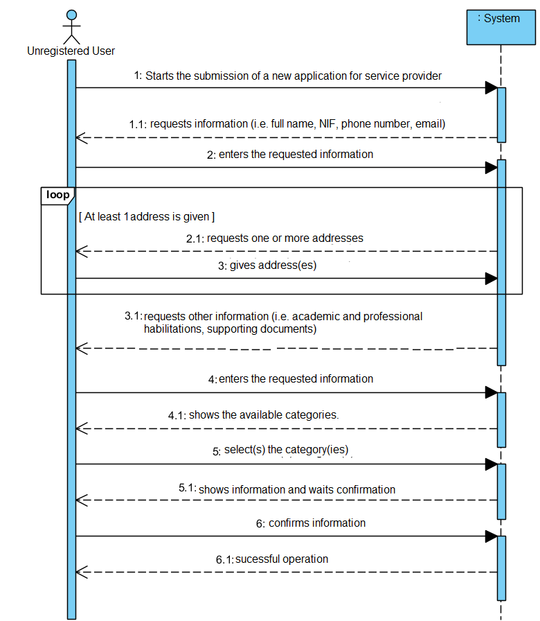

# UC2 - Submit Application to Service Provider

## Short Format

The unregistered user initiates the submission of a new application to be a service provider. The system requests the necessary information for the application (full name, NIF, phone number, email address, postal code, academic and professional habilitations, documents confirming). The unregistered user enters the requested information. The system shows the services categories and requests the selection the categories that it wants to do. The unregistered user chooses the categories. The system validates and presents the info, asking for confirmation. The unregistered user confirms. The system saves the application and informs the unregistered user of the success of the operation.

### SSD

## Full Format

### Main Actor

Unregistered user

### Stakeholders and their interests

**Unregistered user:** intends to show his application for service provider.

**Company:** intends that anyone who wants to collaborate with the company shows his application for service provider.

### Pre-conditions

n/a

### Post-conditions

Saves the application for service provider to the system.

### Main success scenario (or basic flow)

1. The unregistered user initiates the submission of a new application.
2. The system requests the necessary data (i.e. full name, NIF, telephone contact and email).
3. The unregistered user enters the requested data.
4. The system requests a postal address.
5. The unregistered user enters the postal address.
6. The system validates and stores the entered address.
7. Steps 4 to 6 are repeated until all the required postal addresses are entered (minimum 1).
8. The system requires an academic qualification.
9. The unregistered user introduces the academic qualification
10. The system validates and holds the academic qualification.
11. Steps 8 to 10 are repeated until all academic qualifications have been entered.
12. The system requires a professional qualification.
13. The unregistered user introduces the professional qualification.
14. The system validates and holds the professional qualification.
15. Steps 12 to 14 are repeated until all professional qualifications have been completed.
16. The system requests supporting documents.
17. The unregistered user introduces supporting document.
18. The system validates and holds supporting document.
19. Steps 16 to 18 are repeated until all supporting documents have been entered.
20. The system shows the categories of services available in the system.
21. The unregistered user selects the category of services he intends to perform.
22. The system validates and stores the selected category.
23. Steps 20 to 22 are repeated until all categories are entered.
24. The system validates and presents the application data to the unregistered user and asks them to confirm them.
25. The unregistered user confirms the application details.
26. The system registers the new application and informs the unregistered user of the success of the operation.

### Extensions (or alternative flows)

\*a. The unregistered user requests the cancellation of the application.

> The use case ends.

6a. Incomplete Postal Address Information.

> 1. The system informs of missing information.
> 2. The system allows the missing information to be entered (step 5)

   > 2a. The unregistered user does not change the data. The use case ends.

10a. Incomplete Academic Enrollment information.

> 1. The system informs you of missing information.
> 2. The system allows you to enter the missing information(step 9)

> 2a. The unregistered user does not change the information. The use case ends.

14a. Incomplete Professional Qualification information.

> 1. The system informs you of missing information.
> 2. The system allows you to enter the missing information(step 13)

> 2a. The unregistered user does not change the data. The use case ends.

14a. Document format is not supported.

> 1. The system informs you.
> 2. The system allows you to enter another document (step 13)

> 2a. The unregistered user does not change the information. The use case ends.

20a. The system has no service categories to display.

> 1. The system informs that there are no service categories.
> The use case proceeds to step 24.

24a. Required minimum information missing.

> 1. The system informs you of missing information.
> 2. The system allows the missing information be entered (step 3)

> 2a. The unregistered user does not change the information. The use case ends.

24b. The system detects that the information (or any subset of the information) entered
must be unique and already exist in the system.

> 1. The system alerts the unregistered user to the fact.
> 2. The system allows you to change it (step 3)

> 2a. The unregistered user does not change the information. The use case ends.

24c. The system detects that the information entered (or some subset of the
information) are invalid.

> 1. The system alerts the unregistered user to the fact.
> 2. The system allows you to change it (step 3).

> 2a. The unregistered user does not change the information. The use case ends.
 

### Special requirements
n/a

### List of variations of technologies and data
n/a

### Frequency of occurrence
n/a

### Open questions
n/a