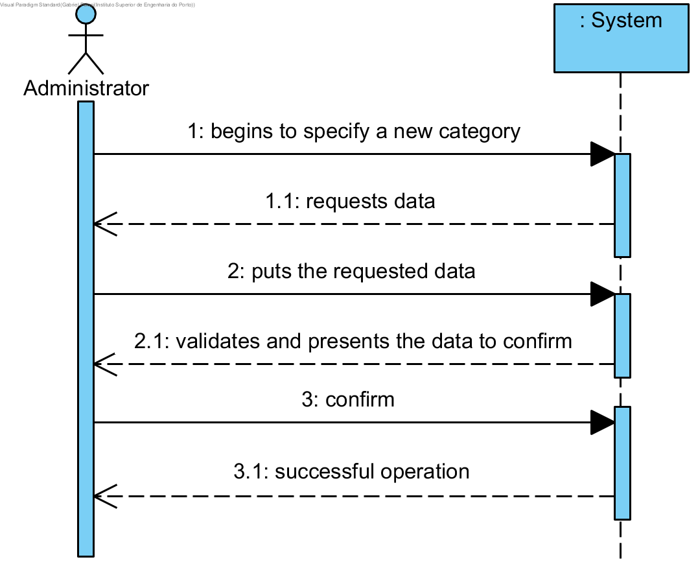

# UC3 - Specify Category (Service)

## Short Format

The administrator begins to specify a new category. The system requests the required data (i.e., unique code and description). The administrator puts the requested data. The system validates and presents the data to the administrator, asking to confirm them. The administrator confirms.The system registers the data and inform to the administrator the success os the operation.

## SSD

## Complete Fromat

### Main actor

Administrator

### Stakeholders and their interests
 

* **Administrator:** intends to specify new categories of services so that it can later catalog the various services provided.
* **Client:** the cataloging of services into categories facilitates the performance of their actions.
* **Company:** want to catalog your services.

### Pre-conditions
n/a

### Post-conditions
Category information is saved in the system.

## Main success scenario (or basic flow)

1. The administrator begins to specify a new category. 
2. The system requests the required data (i.e., unique code and description).
3. The administrator puts the requested data. 
4. The system validates and presents the data to the administrator, asking to confirm them.
5. The administrator confirms.
6. The system registers the data and inform to the administrator the success os the operation.

### Extensions (or alternative flows)

*a. The administrar requests the cancellation of the category specification.

> The use case ends.

4a. Required minimum data missing.
>	1. The system reports wich data is missing.
>	2. The system allows the administrator to enter the missing data (step 3)
>
	>	2a. The administrar does not change the data. The use case ends.

4b. The system detects that some data (or some subset of the data) entered must be unique and already exist in the system
>	1. The system alerts the administrator to the fact.
>	2. The system allows the administrator to change the data(passo 3)
>
	>	2a. The administrar does not change the data. The use case ends.

4c.  The system detects that some data (or some subset of the data) are invalid.
> 2. The system allows the administrator to change the data(passo 3)
> 
	> The administrar does not change the data. The use case ends.

### Special requirements
\-

### List of Variations of Technologies and Data
\-

### Frequency of Occurrence
\-

### Open questions

* Are there other data that is needed?
* What are the mandatory data for specifying a category?
* What data allows you to detect duplication of categories?
* Is the unique code always entered by the administrator, or should the system generate it automatically?
* How often does this use case occur?