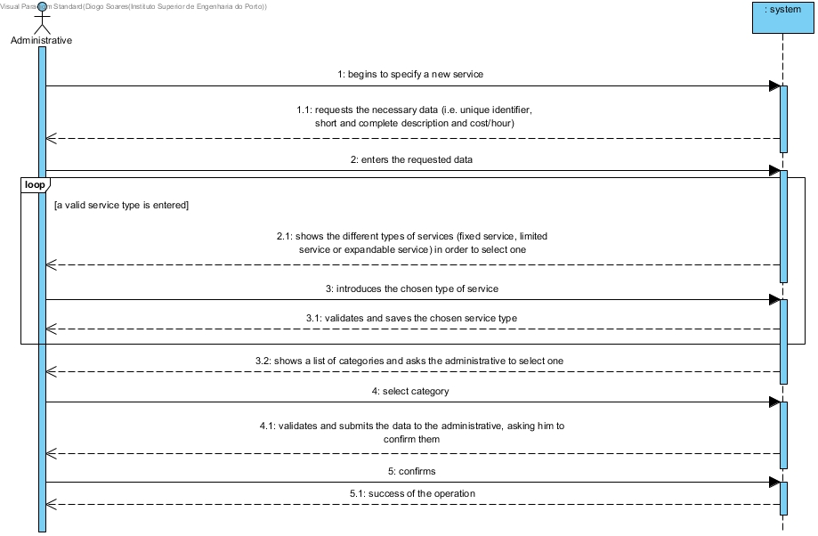

# UC4 -  Especify Service

## Short Format

The administrative begins to specify a new service. The system requests the necessary data (i.e. unique identifier, short and complete description and cost/hour). The administrative enters the requested data. The system shows the different types of services (fixed service, limited service or expandable service) in order to select one. The administrative introduces the type of service. The system validates and saves the chosen type of service. The system validates and displays the data, requesting confirmation. The administrative confirms. The system records the data and informs the administrative of the success of the operation.

## SSD

## Full Format

### Main Actor

Administratrive

### Stakeholders and their interests
* **Administrative:** intends to specify the services provided so that they can be requested by customers.
* **Client:** wants to know the services that can be requested.
* **Company:** wants the services to be described in detail and well catalogued.

### Pre-conditions
n/a

### Post-conditions
Service information is logged in the system.

## Main success scenario (or basic flow)

1. The administrative  begins to specify a new service.

2. The system requests the necessary data (i.e. unique identifier, short and complete description and cost/hour).

3. The administrative  enters the requested data.

4. The system shows the different types of services (fixed service, limited service or expandable service) in order to select one.

5. The administrative  introduces the chosen type of service.

6. The system validates and saves the chosen service type.

7. Steps 4 to 6 are repeated until a type of service is specified by the administrative.
 
8. The system validates and submits the data to the administrative, asking him to confirm them.

9. The administrative confirms.

10. The system records the data and informs the administrative of the success of the operation.

### Extensions (or alternative flows)

*a. The administrative requests the cancellation of the service specification.

> The case of use ends.

4a. There are no categories of services defined in the system.
>       1. The system shall inform the administrative department thereof.
>       2. The system allows the creation of a new category (UC 3).
>
	>       2a. The administrative does not create a category. The use case ends.

6a. Invalid type of service.
>       1. The system informs which service is invalid.
>       2. The system allows the entry of new data (step 5)
>
	>       2a. The administrative does not change the data. The use case ends.

	
8a. Missing mandatory minimum data.
>       1. The system informs which data are missing.
>       2. The system allows the entry of missing data (step 3).
>
	>       2a. The administrative does not change the data. The use case ends.

8b. The system detects that the data (or any subset of the data) entered should be unique and that it already exists in the system.
>       1. The system alerts the administrative authorities to this fact.
>       2. The system allows for its modification (step 3)
>
	>       2a. The administrative does not change the data. The use case ends.

8c. The system detects that the data entered (or some subset of the data) is invalid.
>       1. The system alerts the administrative authorities to this fact. 
>       2. The system allows you to change it (step 3).
> 
	>       2a. The administrative does not change the data. The use case ends. 

### Special requirements
\-

### List of variations of technologies and data
\-

### Frequency of occurence
\-

### Open questions
\-