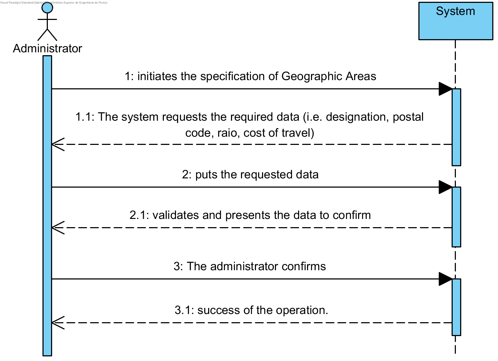

# UC5 - Specify Geographic Area

## Short Format

The administrator begins to specify a new Geographic Area. The system requests the required data (i.e. designation, **postal code, radius,** cost of travel). The administrator puts the requested data. **The system gets the postal codes covered by the new Geographic Area**, validates and presents the data to the administrator, asking to confirm them. The administrator confirms. The system registers the new Geograhic Area and informs the administrator the success of the operation.

## SSD

## Complete Format

### Main Actor 

Administrator

### Stakeholders and their interests

* **Administrator:** intends to specify new Geographic Areas and the costs of travel associated.
* **Client:** wants to know in which geographical areas the company provides services and travel costs.
* **Company:** intends that the geographical areas are described in detail.

### Pre-conditions
n/a

### Post-conditions
 Geographic Area information is saved in the system.a.

## Main success scenario (or basic flow)

1. The administrator begins to specify a new Geographic Area.
2. The system requests the required data (i.e. designation, **postal code, raio,** cost of travel).
3. The administrator puts the requested data.
4. **The system gets the postal codes covered by the new Geographic Area**, validates and presents the data to the administrator, asking to confirm them. 
5. The administrator confirms.
6. The system registers the new Geograhic Area and informs the administrator the success of the operation.

### Extensions (or alternative flows)

*a. The administrar requests the cancellation of the Geaographic Area specification.

> Use case ends.
	
4a. Required minimum data missing.
> 1. The system reports wich data is missing.
> 2. The system allows the administrator to enter the missing data (step 3)
>
	> 2a. The administrar does not change the data.The use case ends.

4b. The system detects that some data (or some subset of the data) entered must be unique and already exist in the system
>	1. The system alerts the administrator to the fact.
>	2. The system allows the administrator to change the data(passo 3)
>
	>	2a. The administrar does not change the data.The use case ends.

4c. The system detects that some data (or some subset of the data) are invalid.
> 1. The system alerts the administrator to the fact. 
> 2. The system allows the administrator to change the data(passo 3)
> 
	> 2a. The administrar does not change the data.The use case ends.

**4d. The system can not determine the postal codes covered by the geographical area**
> 1. The system alerts the administrator to the fact.  
>  The use case ends.

### Special requirements
\-

### List of Variations of Technologies and Data
**The system must use an external service defined by configuration to obtain the postal codes covered by the geographical area** 

### Frequency of Occurrence
\-

### Open questions

* ~~Are there other data that are needed to identify the geographical area?~~
* ~~Wich data is required to identify a geographical area?~~
* Wich data together allow the detection of duplication of geographical areas?
* Is it necessary to keep track of the travel cost associated with the geographical area?
* How often does this use case occur?
* **Should the system alert to territorial overlaps between geographic areas?**
* **Can postal codes obtained through the external service be modified (added, removed) by the administrative one?** 
