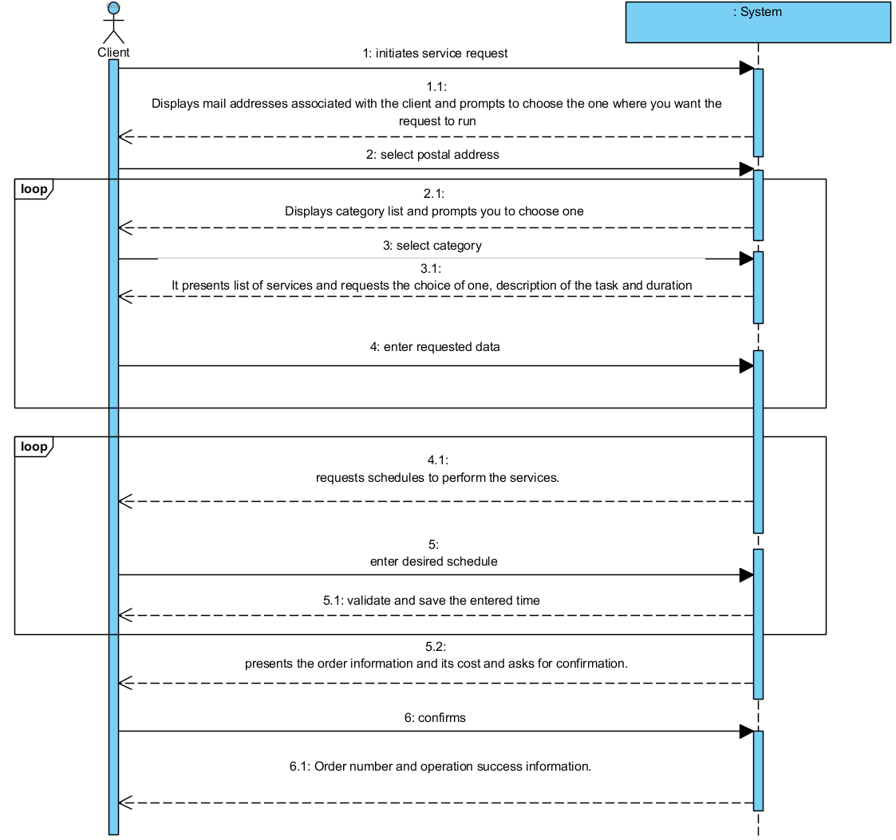

# UC6 - Order Service Provision 

## Short Format

The customer initiates the service request. 
The system displays the postal addresses associated with the customer and prompts to choose the address at which you want the services to be delivered. 
The customer selects the desired postal address. The system displays the service categories and asks the customer to select one. The client selects the category and the system presents the services of that category, asking the client to select one of them.
The client selects the desired service, complements the request with a representative description of the task that is intended to be performed and, in the case of services that allow the duration specification, also indicates the expected duration of the task execution.
The selection of categories and services described above is repeated until all the services intended by the client are specified. Subsequently, the system requests the introduction of one or more times (date and time of start) preferred for the execution of the task.
The customer enters these times. The system validates the order, calculates its estimated cost and presents the result to the customer asking them to confirm. The customer confirms the request. The system registers it, assigns it a sequential number, ** sends the request information by email to the customer ** and presents it to the customer together with a message of success.

## SSD

## Full Format

### Main Actor

Client

### Stakeholders and their interests
* **Client:** intends to register the request so that it can enjoy the services provided by the company.
* **Company:** wants customers to request services.

### Pre-conditions
- There is at least one servisse defined in the system.

### Post-conditions
The order information is stored in the system.

## Primary success scenario (or basic flow).

1. The customer initiates the service request.
2. 
The system displays the postal addresses associated with the customer and prompts you to choose the address at which you want the services to be delivered.
3. The customer selects the desired postal address.
4. The system displays the service categories and asks the customer to select one.
5.The customer selects the desired category.
6. The system presents the services of this category, asking the client to select one of them and complemented by a representative description of the task to be performed and, in the case of services that allow the specification of the duration, also informs the duration of the task.
7. The customer selects the desired service and enters the description and estimated duration.
8. The system validates and saves the information entered.
9. Steps 4 to 8 are repeated until all services desired by the customer are specified.
10. The system requests to enter a preferred schedule (start date and time) to execute the task.
11. The client enters the desired schedule.
12. The system validates and saves the schedule entered.
13.Steps 10 to 12 are repeated until at least one time is set.
14. The system validates the request, calculates the estimated cost, and presents the result to the customer asking them to confirm.
15.The customer confirms the request.
16. The system registers it, assigns it a sequential number, ** sends the request information by email to the customer ** and presents it to the customer together with a message of success.

### Extensions (or alternate flows)

*a. The client requests the cancellation of the registration.

> The use case ends.

2a.The system detects that the customer only has a postal address.
>	1.The system assumes the known postal address and informs the customer thereof.
>	2.The system advances to step 4.

**3a. The client informs you that want to use a different postal address.**
>	1.The system allows the customer to associate another postal address with their information (UC7).
>	2. The system returns to step 2.

6a. There are no services specified for the category you want.
> 1. The system informs the customer of this fact.
> 2. The system allows to select another category (step 5).

	
8a. Minimum missing data required
>	1. The system tells which data is missing.
>	2. The system allows to enter the missing data (step 7).

12a. Minimum missing data required
>	1. The system tells which data is missing
>	2. The system allows to enter the missing data (passo 10)

14a.The system detects that the entered data (or some subset of the data) is invalid.
> 1. The system alerts the customer to the fact.
> 2. The system allows to change it (step 3).
> 
	> 2a. The client don`t change the data. The use case ends. 

### Special Requirements
- **The minimum time to execute any service is 30 minutes, and it is only possible to request multiples of this value.**
- **The duration indication is limited by the selected (type of) service**

### List of Technologies and Data Variations
\-

### Frequency of occurrence 
\-

### Open questions

* Can the customer place an order without specifying a category?
* Is the description of the task to be performed mandatory?
* What is the maximum number of hours possible?
* ~~ For services that require the indication of the amount of time, should this be interpreted as the maximum or minimum amount of time? Is it a mandatory? ~~
* ~~ The amount of time is a value in hours. Is it an integer value or does it support decimal part?
* Should the system assume that there is infinite capacity to perform the services?
* What is the validation of the request by the system?
* Can a service be accepted without there being at least one service provider to perform the task?
* ~~ Is there an availability schedule for service providers? ~~
* Should the system accept requests from all clients, or is there a list of banned / allowed clients (eg blacklist / whitelist of clients)?
* Should acceptance of a service request imply escalation of a service provider to the task?
*Will the order number (generated by the system) only be shown to the customer or should we expect to send a confirmation email?
* Knowing the cost is estimated, should we allow the client to specify a maximum value for the execution of the task?