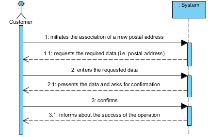

UC7 – Associate Postal Address with Customer
==============================

Short Form
-------------

The customer initiates the association of a new postal address with their information. The system requests the required data (postal address). The customer enters the requested data. The system validates and displays the data, asking customer to confirm them. The customer confirms. The system associates the postal address with the customer and informs the customer of the success of the operation.

SSD
---

Full Format
----------------

### Main actor

Customer

### Stakeholders and their interests

-   **Customer:** pretends to add a new address to customer's address book.

-   **Company:** pretends that the customer can request services for any of customer's addresses.

### Pre-conditions

Be authenticated in the system as a customer.

### Post-conditions

The client address is stored in the system.

Primary success scenario (or base flow)
----------------------------------------------

1. The customer initiates the association of a new postal address with their information.
2. The system requests the required data (i.e. postal address).
3. The customer enters the requested data.
4. The system validates and displays the data, asking costumer to confirm them.
5. The customer confirms.
6. The system associates the postal address with the customer and informs the customer of the success of the operation.
    

### Extensions (or alternate flows)

\*a. The customer requests the cancellation of the registration.

>   The use case ends.

4a. Required minimum data missing.

>   The system informs the customer about which data is missing.

>   The system allows the customer to enter the missing data (step 2)

>   2a. The customer does not change the data. The use case ends.

4b. The system detects that the data (or some subset of the data) entered must be unique and already exist in the system.

>   The system alerts the customer to the fact.

>   The system allows the customer to change it (step 2)

>   2a. The customer does not change the data. The use case ends.

4c. The system detects that the entered data (or some subset of the data) is invalid.

>   The system alerts the customer to the fact.

>   The system allows the customer to change it (step 2)

>   2a. The customer does not change the data. The use case ends.

### Special requirements

\-

### List of Variations of Technologies and Data

\-

### Frequency of Occurrence

\-

### Open questions

-   What data together allow to detect duplicate addresses?
-   Should the customer have a postal address as preferred?
-   How often does this use case occur?