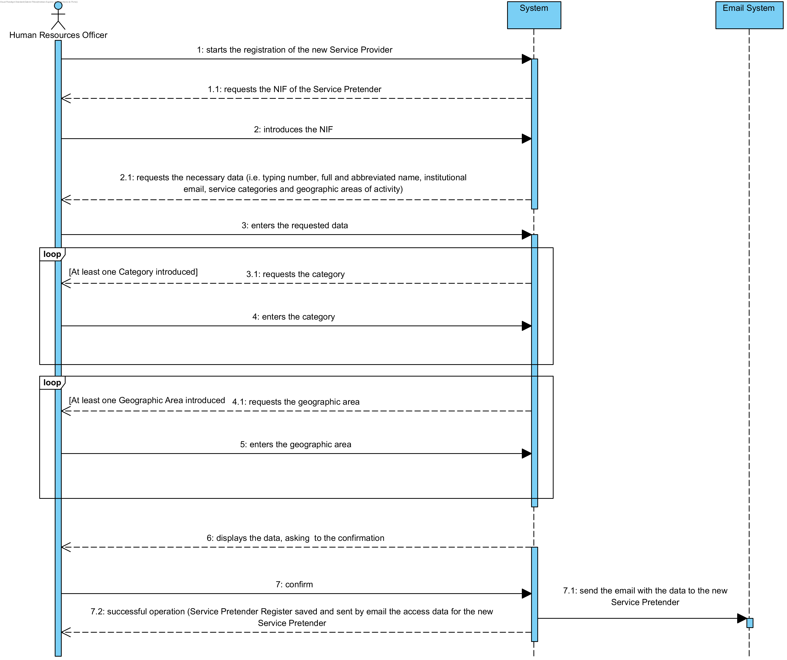
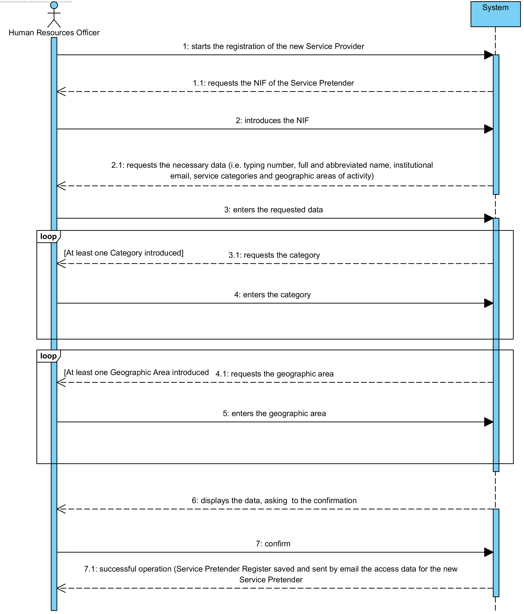

# UC8 - Register Service Provider

## Short Format

The Human Resources Officer starts registering the new Service Provider. The System requests the NIF of the Service Pretender. The Human Resources Officer introduces the NIF.The system requests the necessary data (i.e. typing number, full and abbreviated name, institutional email, service categories and geographic areas of activity).The Human Resources Officer  enters the requested data.The system validates and displays the data, asking you to confirm them. The Human Resources Officer  confirms the data presented by the system. The system ** registers the data of the new Service Provider ** and informs the Human Resources Officer  of the success of the operation. The system **sends the access data to the new Service Provider **.

## SSD

## Alternative SSD with Email System
At the end of the UC we have the activity of notifying the Service Provider regarding their access data, using an email system. The information to be sent to the Service Provider via the email system is not the responsibility of the Human Resources Officer . The alternative presented treats this activity as a message between the system to be developed and an external Mail System (outside the scope of the system being analyzed). In this way, it is emphasized that this requirement requires interaction with an external e-mail system.

## Complete Format

### Main Actor

Human Resources Officer (HRO)

### Stakeholders and their interests
* **Human Resources Officer ** intends to register the Service Providers so that it is possible to make available the services provided by the company.
* **Company:** ntends that the Service Provider be available to perform the services requested by its clients.
* **Service Pretender** needs to have an access profile to indicate its availability in order to perform the services requested by the Company's customers.

### Pre-conditions
There are Service Categories and Geographic Areas defined in the system.

### Post-conditions
The registration information is stored in the system.

## Main success scenario (or basic flow)

1. The Human Resources Officer  starts registering the new Service Provider. 
2. The system requests the necessary data (i.e. typing number, full and abbreviated name, institutional email, service categories and geographic areas of activity).
3. The Human Resources Officer  enters the requested data. 
4. The system shows the existing service categories and requests one.
5. The Human Resources Officer  selects the desired service category.
6. The system validates and stores the selected category.
7. Steps 4 to 6 are repeated until all the desired categories are selected (minimum 1).
8. The system shows the existing geographic areas and requests one.
9. The Human Resources Officer  selects the intended geographical area.
10. The system validates and stores the selected geographical area
11. Steps 8 through 10 are repeated until all the desired geographic areas are selected (minimum 1).
12. The system validates and displays the data, asking you to confirm them.
13. The Human Resources Officer  confirms.
14. The system **registers the data of the new Service Provider, sends the access data to the new Service Provider** and informs the Human Resources Officer  of the success of the operation.

### Extensions (or alternative flows)

*a. The Human Resources Officer  requests the cancellation of the registration.

> The use case ends.

3a. data of typing number and/or name complete/abbreviated and/or duplicated emails.
>	1. The system informs the Human Resources Officer  about the duplication of data.
>	2. The system allows the introduction of new data
>
	>	2a. The Human Resources Officer  does not change the data. The use case ends.

6a. Incomplete/duplicate Category data.
>	1. The system reports missing or duplicate data
>	2. The system allows the introduction of new data
>
	>	2a. The Human Resources Officer  does not change the data. The use case ends.

10a. Incomplete/duplicate Geographic Area data.
  >	1. The system reports missing or duplicate data
  >	2. The system allows the introduction of new data
  >
  	>	2a. The Human Resources Officer  does not change the data. The use case ends.

12a. The system detects that the data (or some subset of the data) entered must be unique and already exist in the system.
>	1. The system alerts the Human Resources Officer  to the fact.
>	2. The system allows the introduction of new data
>
	>	2a. The Human Resources Officer  does not change the data. The use case ends.

12b. The system detects that the entered data (or some subset of the data) is invalid.
> 1. The system alerts the Human Resources Officer  to the fact.
> 2. The system allows you to change it.
>
	> 2a. The Human Resources Officer  does not change the data. The use case ends.

### Special requirements
\-

### List of Variations of Technologies and DataO sistema alerta o Human Resources Officer  para o facto.
\-

### Frequency of Occurrence
\-

### Open questions

* Are there any other mandatory data besides those already known?
* What data together allow you to detect the duplication of Service Providers?
* What are the security rules applicable to access data?
* What is the email system to adopt?
* Do we have to support more than one email system?
* How is defined which email system to use?
* How often does this use case occur?