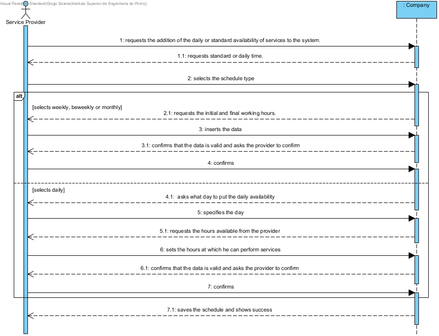


# UC9 - Indicate Daily Availability of Services

## Short Format

The service provider requests the addition of the daily, weekly, biweekly or monthly of availability to the system.
The system requests the type of addition that the service provider intends
The provider selects the type of availability.
If the provider selects weekly, biweekly or monthly: (The system requests the initial and final working hours. The provider inserts the data). If the provider selects daily: (The system asks what day to put the daily availability. The service provider specifies the day.
The system requests the initial and final working hours. The provider inserts the data.)
The system confirms that the data is valid and asks the provider to confirm.
The provider confirms.
The system saves.

## SSD

## Complete Format

### Main Actor
Service Provider.

### Stakeholders and their interests
* **Service Provider:** want to add your availability
* **Company:** want to know which service providers are available on certain days and times.

### Pre-conditions
n/a

### Post-conditions
The information on the daily availability of this service provider is stored in the system.

## Main success scenario (or basic flow)

1. The service provider requests the addition of the daily, weekly, biweekly or monthly of avibility to the system.
2. The system requests the type of addition that the service provider intends.
3. The provider selects the type of availability.
4. If the provider selects weekly, biweekly or monthly:
    5. The system requests start and end time of work.
    6. The provider enters the data.
    7. The system displays the data and prompts for confirmation.
    8. The provider confirms.
9. If the provider selects daily:
    10. The system requests the day that Service Provider want to place daily availability.
    11. The provider specifies the day.
    12. The system requests start and end time of work.
    13. The provider enters the data.
    14. The system displays the data and prompts for confirmation.
    15. The provider confirms.
16. The system saves the Availabilty and shows success.

### Extensions (or alternative flows)

*a. The provider requests the cancellation of the request.

> The use case ends.

3a. Required minimum data missing.
> 1. The system informs you of missing data.
> 2. The system allows the missing data to be entered (step 3)
>
    > 3a. The provider does not change the data. The use case ends.

6a. Required minimum data missing.
> 1. The system informs you of missing data.
> 2. The system allows the missing data to be entered (step 6)
>
    > 6a. The provider does not change the data. The use case ends.    

11a. Required minimum data missing.
> 1. The system informs you of missing data.
> 2. The system allows the missing data to be entered (step 11)
>
    > 11a. The provider does not change the data. The use case ends. 

13a. Required minimum data missing.
> 1. The system informs you of missing data.
> 2. The system allows the missing data to be entered (step 13)
>
    > 13a. The provider does not change the data. The use case ends.       

3b. The system detects that the entered data (or some subset of the data) is invalid.
> 1. The system alerts the provider to the fact.
> 2. The system allows you to change it (step 3).
>
    > 3b. The provider does not change the data. The use case ends.

6b. The system detects that the entered data (or some subset of the data) is invalid.
> 1. The system alerts the provider to the fact.
> 2. The system allows you to change it (step 6).
>
    > 6b. The provider does not change the data. The use case ends.    

11b. The system detects that the entered data (or some subset of the data) is invalid.
> 1. The system alerts the provider to the fact.
> 2. The system allows you to change it (step 11).
>
    > 11b. The provider does not change the data. The use case ends.

13b. The system detects that the entered data (or some subset of the data) is invalid.
> 1. The system alerts the provider to the fact.
> 2. The system allows you to change it (step 13).
>
    >13b. The provider does not change the data. The use case ends. 

### Special requirements
\-

### List of Variations of Technologies and Data
\-

### Frequency of Occurrence
\-

### Open questions
\-